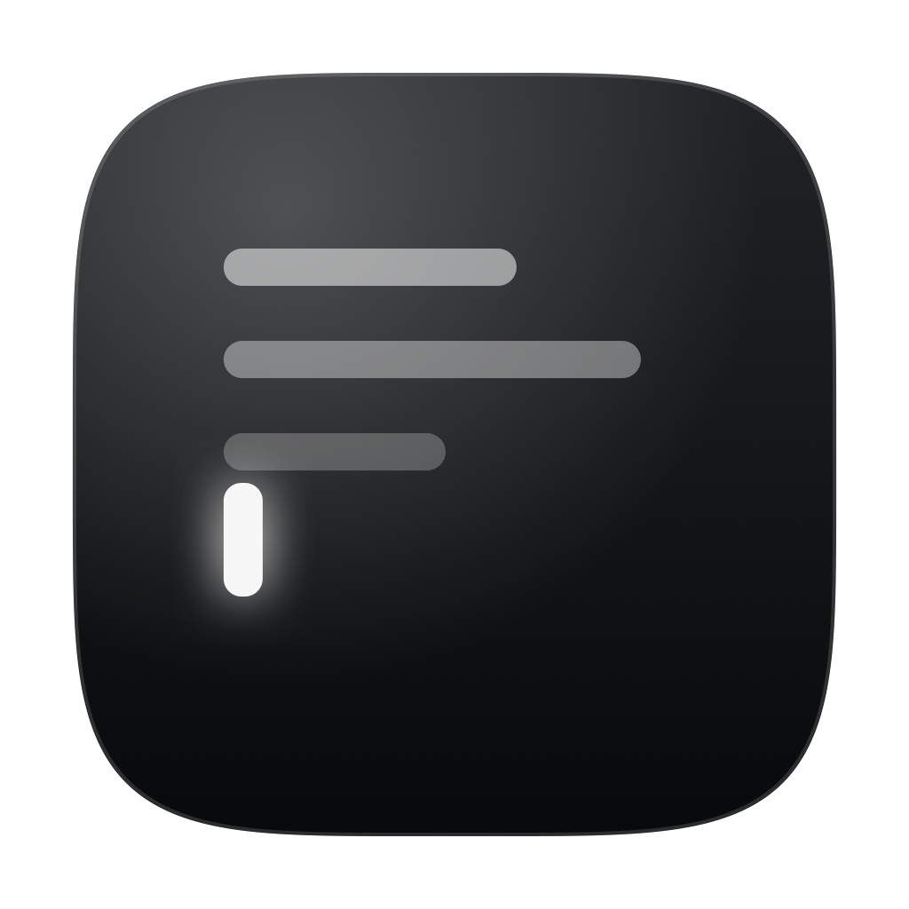
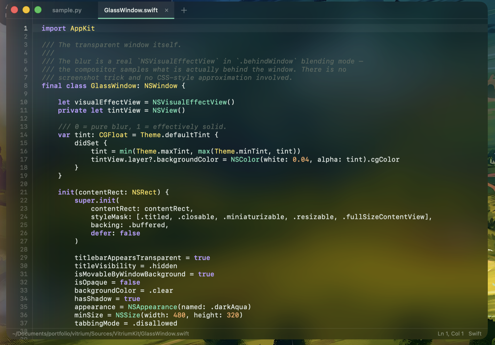

<div align="center">



# Vitrium

**A transparent text editor for macOS.**

Real compositor blur. Native AppKit. Zero dependencies.

<p>
  
  
  
  
  
</p>

<br />



<sub>Vitrium editing its own <code>GlassWindow.swift</code>. That's the desktop showing through — not a screenshot behind the window.</sub>

</div>

<br />

---

## The short version

No Electron, no WebView, no HTML or CSS anywhere in the stack. The blur is an `NSVisualEffectView` in `.behindWindow` blending mode, which means the compositor samples what is genuinely behind the window. Drag it across your wallpaper and the glass changes with it.

```zsh
git clone https://github.com/chakri192/vitrium.git
cd vitrium && ./Scripts/bundle.sh && open build/Vitrium.app
```

**Xcode is not required.** Command Line Tools is enough — `xcode-select --install`.

---

## What it does

|  | |
|---|---|
| **Glass** | Compositor-level blur, on by default, with a tint you can take from bare blur to nearly solid. Tab strip, gutter, editor and status bar all sit on one pane. |
| **Tabs** | New, close, close others/all, switch by keyboard or click. Opening a file into an empty untitled tab reuses it rather than piling up. |
| **Highlighting** | Python, C/C++, Swift, JavaScript/TypeScript, Shell, YAML, JSON, Markdown. Detected from the filename, or set by hand from the status bar for a tab you haven't saved yet. |
| **Find & Replace** | Case-sensitive and whole-word toggles, live match count, wraparound, Replace All as one undo step. |
| **Editing** | Comment toggle, duplicate line, move line up/down, indent/outdent, auto-indent, bracket and quote auto-close, bracket-match highlighting, go to line. |
| **Atomic saves** | Every write lands in a sibling temp file and only replaces the target once complete. A crash mid-save leaves the original intact, never truncated. |
| **Off the main thread** | Loads and interactive saves run in the background. Closing a dirty tab blocks — that's the one place the answer is needed before the tab can go away. |
| **Drag and drop** | Drop files anywhere on the window, the editor body included, to open them as tabs. |
| **Watches the disk** | Prompts to reload when a file changes underneath you, and never mistakes your own save for someone else's edit. |
| **Session restore** | Reopens what was open, and remembers window geometry, zoom, word wrap and glass tint. |

---

## Three details that make the glass real

**`.behindWindow` blending.** The compositor samples the actual desktop. This is the part a CSS `backdrop-filter` cannot do — it can only blur what the page itself drew.

**Every view non-opaque.** Scroll view, clip view, text view and gutter all set `drawsBackground = false`. A single opaque view anywhere in the chain punches a solid rectangle through the effect.

**One tint layer, not many.** A single dark wash over the blur, adjustable with <kbd>⌘</kbd><kbd>⌥</kbd><kbd>[</kbd> and <kbd>⌘</kbd><kbd>⌥</kbd><kbd>]</kbd>. Tinting each view separately is exactly what makes glass UIs look patchy.

> A window that's movable by its background makes AppKit treat every non-opaque view as draggable chrome. The tab strip and status bar have to opt out explicitly, or clicking a tab drags the window instead of switching tabs.

---

## How highlighting works

Each language's rules compile into **one alternation regex, in precedence order** — comments and strings first, then keywords, numbers, functions, types. ICU tries alternatives left to right at each position, so the first rule that matches claims those characters outright.

That ordering is the whole design. The obvious alternative — apply rules in sequence, let later ones overwrite earlier ones — cannot express both of these at once:

- a keyword inside a string is not a keyword
- a quote inside a comment does not open a string

Whichever of the two you apply last wins in *both* directions, and one of them is always wrong. The Qt version had this bug: `for` and `with` came out bold violet inside Python docstrings.

Only the edited lines are recoloured per keystroke, so typing is O(line), not O(document). Block comments are the exception, since they span arbitrary distance: the recolour window widens to the end of the file whenever an edit touches a `/*` or `*/`, and the scan restarts from the last `*/` above the edit — the nearest point guaranteed to be outside a comment.

---

## Keyboard

| | |
|---|---|
| <kbd>⌘O</kbd> <kbd>⌘S</kbd> <kbd>⌘⇧S</kbd> | Open · Save · Save As |
| <kbd>⌘⇧O</kbd> | Recent files |
| <kbd>⌘T</kbd> <kbd>⌘W</kbd> | New tab · Close tab |
| <kbd>⌘⌥W</kbd> <kbd>⌘⌥⇧W</kbd> | Close others · Close all |
| <kbd>⌘⇧]</kbd> <kbd>⌘⇧[</kbd> · <kbd>⌃⇥</kbd> <kbd>⌃⇧⇥</kbd> | Next · previous tab |
| <kbd>⌘F</kbd> <kbd>⌘⌥F</kbd> <kbd>⌘G</kbd> <kbd>⌘⇧G</kbd> | Find · Find & Replace · Next · Previous |
| <kbd>⌘L</kbd> | Go to line |
| <kbd>⌘/</kbd> | Toggle comment |
| <kbd>⌘D</kbd> | Duplicate line |
| <kbd>⌥↑</kbd> <kbd>⌥↓</kbd> | Move line up · down |
| <kbd>⌘]</kbd> <kbd>⌘[</kbd> | Indent · outdent |
| <kbd>⌥Z</kbd> | Toggle word wrap |
| <kbd>⌘=</kbd> <kbd>⌘-</kbd> <kbd>⌘0</kbd> | Zoom in · out · reset |
| <kbd>⌘⌥[</kbd> <kbd>⌘⌥]</kbd> | More · less transparent |
| <kbd>⌘⇧R</kbd> | Reveal in Finder |

<kbd>⌃⇥</kbd> is bound to the *physical* Control key, matching Safari, Xcode and Terminal.

---

## Architecture

`Sources/VitriumKit` holds everything. `Sources/Vitrium` is a three-line executable, `Sources/VitriumTests` the test runner. The split exists so the tests can reach real code through `@testable import`.

| File | Responsibility |
|---|---|
| `GlassWindow` | Transparent window, blur, tint layer |
| `MainWindowController` | Window chrome, tab list, file operations, find |
| `Document` | One tab: URL, dirty state, load/save, external-change tracking |
| `EditorPane` | Scroll view + text view + gutter + highlighter, one per tab |
| `EditorTextView` | Auto-indent, auto-close, line operations, per-tab undo, file drops |
| `SyntaxHighlighter` | Incremental colouring over `NSTextStorage` |
| `Language` | Detection, keywords, comment syntax, rule precedence |
| `LineIndex` · `LineNumberRuler` | Line offsets and the gutter |
| `TabBarView` · `FindBarView` · `StatusBarView` | The three chrome pieces |
| `FileIO` · `Preferences` | Atomic saves, async loads, persisted settings |

Two decisions worth knowing about:

**Each tab owns a whole `EditorPane`,** rather than sharing one text view and swapping its storage. Slightly more memory; in exchange, scroll position, selection and undo survive a tab switch with no bookkeeping at all.

**Each tab owns its own `UndoManager`.** AppKit's default is the *window's*, which every tab would share — so undo in one tab could walk back an edit made in another.

---

## Tests

```zsh
./Scripts/test.sh
```

53 tests: highlighting precedence, incremental-versus-full colouring agreement, line numbering, the line-editing operations, search, dirty tracking, and both save paths including the edit-during-async-save race.

Not `swift test`, deliberately. XCTest ships only with Xcode, and the Command Line Tools' copy of swift-testing is missing its Foundation overlay. The suite is a plain executable, so it runs anywhere Swift does — the same bar the app itself is held to.

---

## The icon

Drawn in code, not exported from a design tool — `Scripts/make-icons.swift` renders it with CoreGraphics, and `Scripts/make-icns.sh` builds the `.icns`. Every size in the iconset is rendered natively rather than downscaled from one master, which is what keeps the caret legible at 16px.

```zsh
./Scripts/make-icns.sh caret-mono
```

Four designs are in the file (`caret-mono`, `caret-accent`, `caret-green`, `monogram`, `window`, `panes`) — pass any of them.

---

## What it doesn't do

No multi-cursor or split view. No LSP, autocomplete or semantic analysis — highlighting is lexical. No plugin system. No print, Save All, encoding picker or regex find. macOS only: the glass, the window conventions and the entire UI layer are AppKit.

---

## License

MIT © V Chakradhar

<sub>Written with [aider](https://github.com/Aider-AI/aider) driving local models via [Ollama](https://ollama.com).</sub>

## Contributors

| | |
|---|---|
| [chakri192](https://github.com/chakri192) | Author |
| [aider](https://github.com/Aider-AI/aider) | AI pair programmer |
